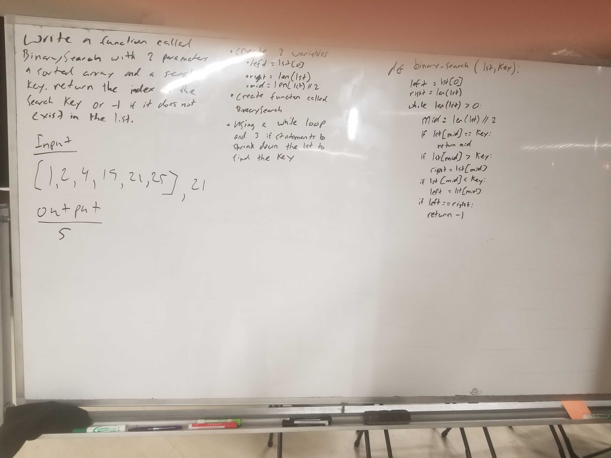

# Challenge Summary
The challenge today was to search through a list if a key value exists in the list. If the key value exist return the index of its position or return -1 if it does not exist

## Challenge Description
Have a method that searches through a list to see if a key value exists in the list.

## Approach & Efficiency
Started out by creating a method called binary_search_array that took in two parameters, an ordered list (lst) and a key value (key). Then, created two variables (left = lst[0], right = len(lst)). Next, initiated a while loop. Within the while loop there is a variable (mid) to hold onto the mid index. Finally used three if statements to narrow down the array to see in the key does exist within the list.

## Solution
