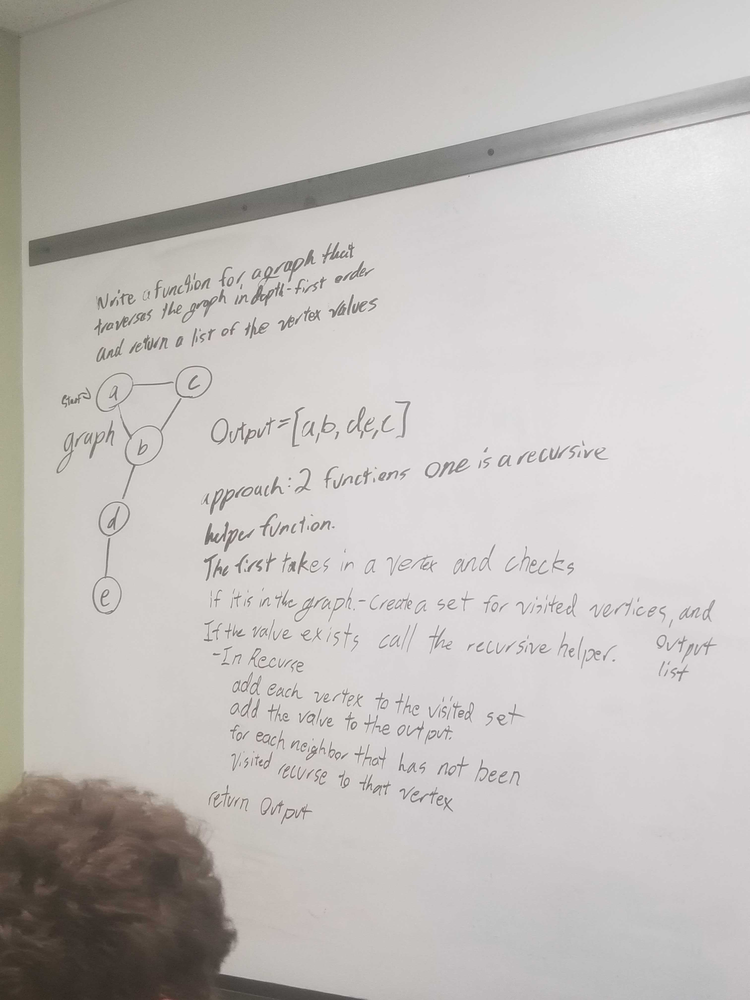
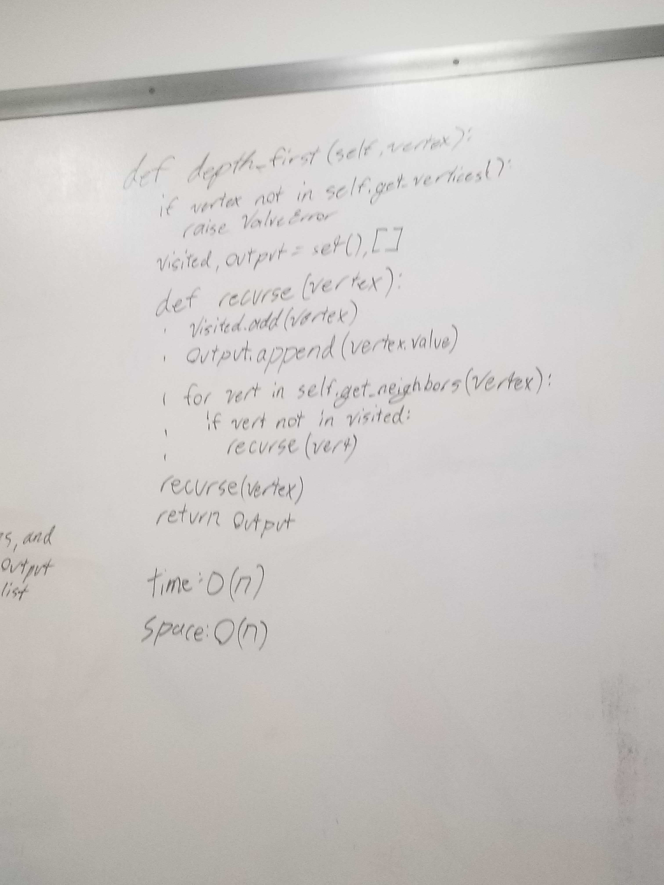

# Challenge Summary
A high level summary of this challenge was to create a method that takes in an adjancency list. It then returns a collection of nodes in there pre-order depth-first traversal order

## Challenge Description
For this challenge we are to create a method that takes in an adjacency list as a parameter. Using that list it needs to use a depth-first traversal to get all of the nodes in a pre-order list. 

## Approach & Efficiency
To complete this challenge I used an imbedded recurse method to traverse the graph and to also add the vertex to the set of visited vertex's and also appened it to the output list of vertex values. After looking at all of the vertex's in the graph, the method will return the output list.

#### big O
time - O(n)
space - O(n)

## Solution

