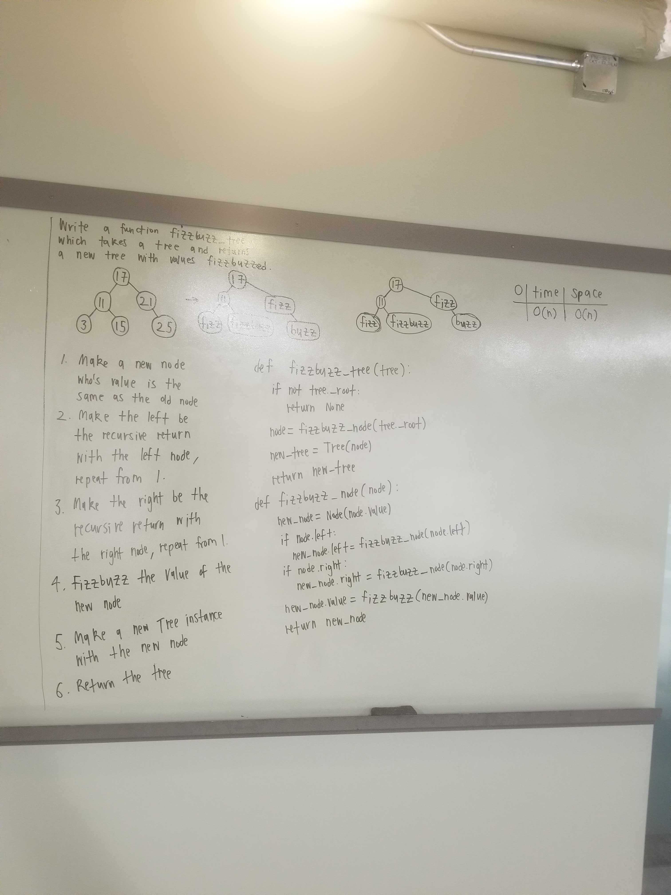

# Challenge Summary
The challenge was to create the methods needed to use FizzBuzz over a tree

## Challenge Description
Using the data structure trees. We needed to create the methods needed to have an output of the tree to have all the values that are divisible by 3 become the string of Fizz, if divisible by 5 becomes the string Buzz, and if divisible by both 3 and 5 it becomes the string of FizzBuzz

## Approach & Efficiency
To complete the challenge I had to import the BinaryTree and BinarySearchTree classes from the tree file. I then created three methods fizz_buzz, fizz_buzz_tree, and fizz_buzz_node. The fizz_buzz function handled the math to determine if the value needed to be converted to the respective string. Next, the fizz_buzz_node handles the traverse of the tree. The fizz_buzz_tree methonds creates the new tree.

## Solution

