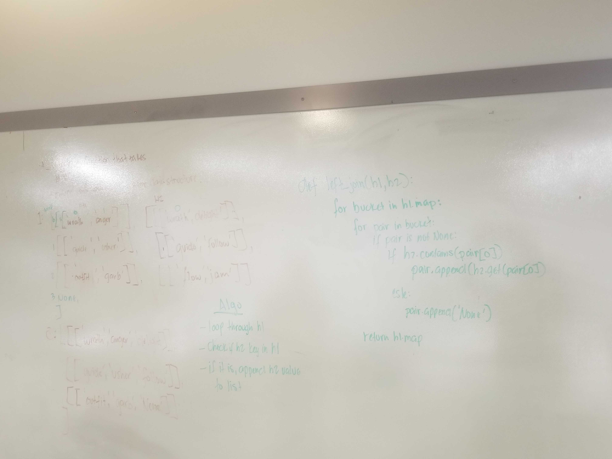

# Hashmap LEFT JOIN
A summury of this problem is pretty short and to the point. We are given two hashtables and we need to create the method(s) needed to left_join them.

The challenge is you are given two hashtable and you have to left_join them together. If the key from the second hashtable and not in the first you do not add it into the first. If the key from the first is not in the second hashtable, the value given ffrom the left_join function is None.

## Challenge
The challenge is you are given two hashtable and you have to left_join them together. If the key from the second hashtable and not in the first you do not add it into the first. If the key from the first is not in the second hashtable, the value given from the left_join function is None.

## Approach & Efficiency
The aprouch I took to solve this challenge was a pretty simple one. Create a variable to hold an empty list. Loop through the first dictionary and then check to see if the keys were in the second dictionary. If they keys were in both dictionaries. The key and the values from both are appended and added to the results list. If the key from the first is not in the second dictionary. Then, the key, the first value, and a value of None is appended for the second dictionary.

Big O -
time - O(n)
space - O(n)

## Solution
