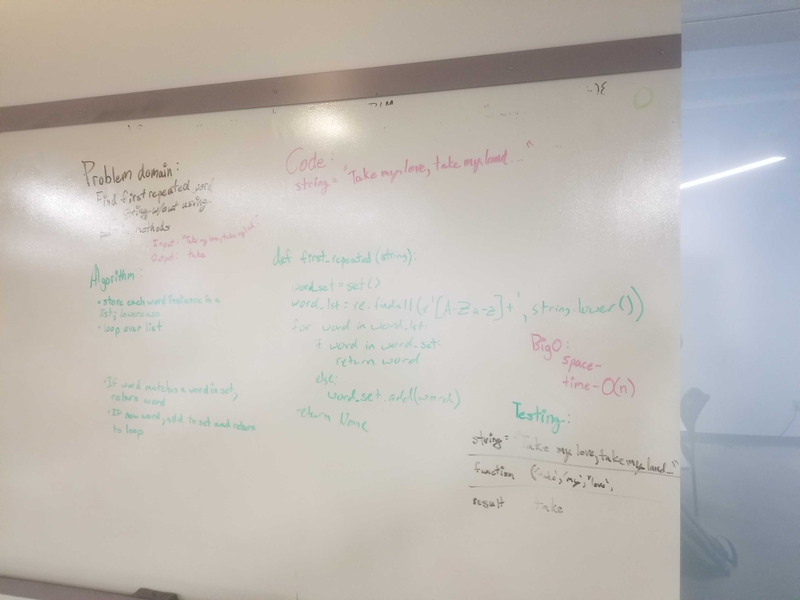

# Challenge Summary
Given a string of words we are to find the first word that is repeated.

## Challenge Description
The challenge today is to create a method that takes in a string and returns the first word that is repeated. 

## Approach & Efficiency
The approach that I took to complete the challege is to use a loop to go over a set to see if the word is in the set. Using regex we took only the word charaters and converted them all to lowercase. The words in the word_lst is then ran through a loop to see if any of the words are in the word set. If the word is not in the set it in added to the word_set. If it is already in the set it is returned. 

#### Big O
time - O(l), 
space - O(l)

## Solution
